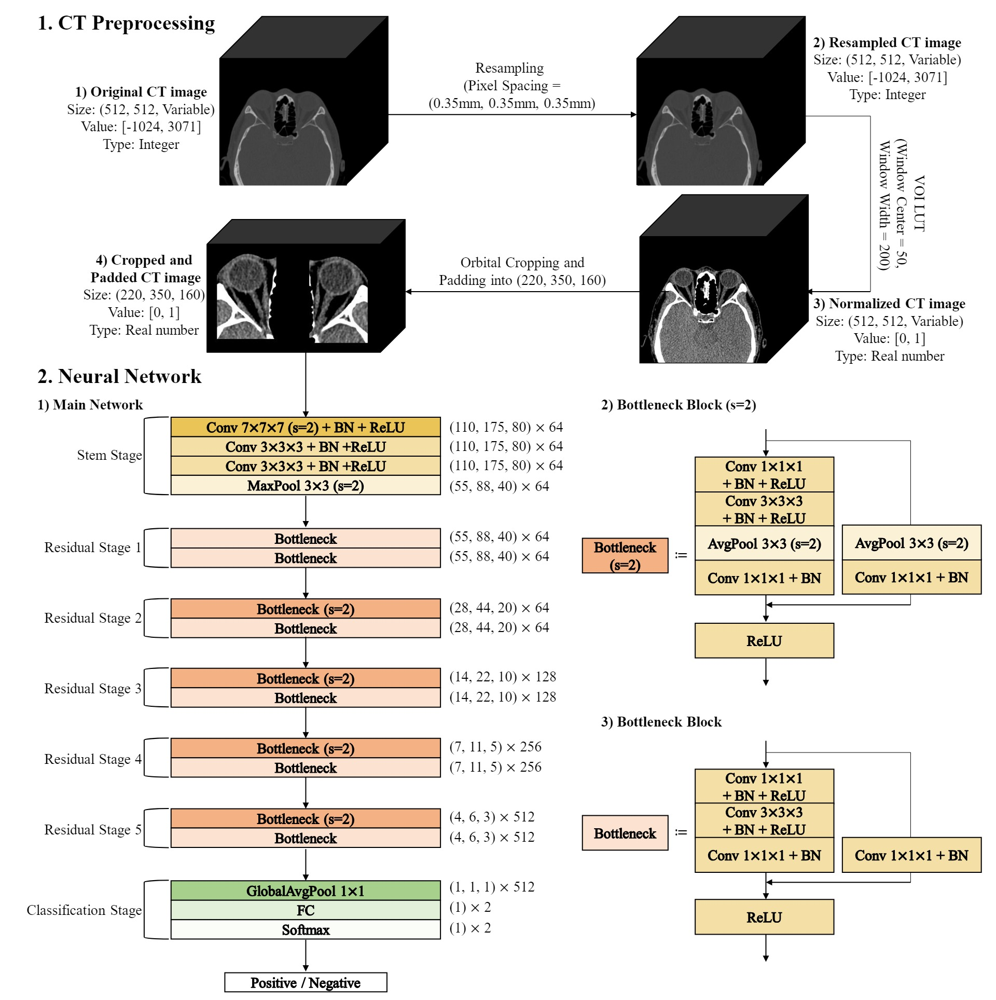

# PyTorch Implementation of GOTDNet (Graves' Orbitopathy Treatment Decision Network)
 
The architecture was referencted by a manuscript entitled, "Deep Neural Network with High-Resolution Feature Enhancement and Low-Resolution Feature Preservation for Automated Treatment Decision of Graves’ Orbitopathy Patients." 

## Overview
This repository contains an official implementation of GOTDNet using PyTorch.<br/>


## Data preprocessing and Neural Network

## Paper
If you use this software for your research, please cite:

```bibtex
@article{lee2024deepneural,
  title={Deep Neural Network with High-Resolution Feature Enhancement and Low-Resolution Feature Preservation for Automated Treatment Decision of Graves’ Orbitopathy Patients},
  author={Sanghyuck Lee, Mohd Asyraf Zulkifley, Jeong Kyu Lee, and Jaesung Lee},
    year={2024},
  }
```

## License
This program is available for download for non-commercial use, licensed under the GNU General Public License. This allows its use for research purposes or other free software projects but does not allow its incorporation into any type of commercial software.

## Files
The repository contains the following files:
- `main.ipynb`: Ipynb script file, containing the PyTorch implementation of the execution of the main experiments.
- `GOTDNet.py`: Python script file, containing the PyTorch implementation of the GOTDNet.
- `README.md`: Markdown file explaining the model source code.
